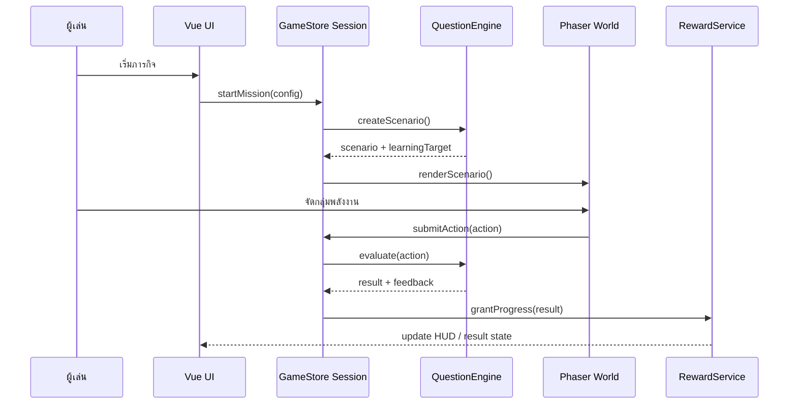

# Technical Architecture

## Stack

- Vite สำหรับ dev server และ production build
- Vue 3 Composition API สำหรับ shell, menu, HUD และ modal
- `GameStore + Vue reactive` สำหรับ session state ใน MVP; persistence orchestration จะเพิ่มผ่าน repository เมื่อมี save data จริง
- Phaser 3 สำหรับฉาก 2D, input hit test, tween, particles และ camera
- Tailwind CSS + DaisyUI สำหรับ UI ที่ไม่ใช่ canvas
- Zod หรือ JSON Schema สำหรับ validate configuration
- Vitest สำหรับ unit tests และ Playwright สำหรับ smoke/e2e

ไม่ใช้ Phaser, PixiJS และ Three.js พร้อมกันใน MVP เพราะทำให้มีหลาย rendering model โดยไม่เพิ่มคุณค่าการเรียนรู้ Three.js จะพิจารณาในภายหลังเฉพาะเมื่อมีความต้องการ 3D จริง

## OOP domain

- `GameSession`: lifecycle, timer, lives, score, progression
- `Mission`: objective, table range, multiplier range, completion rules
- `QuestionEngine`: สร้างสถานการณ์และ adaptive selection
- `WorldScene`: render state ของฉากและรับ input จาก Phaser
- `Actor`: position, velocity, behavior state, animation state
- `RewardService`: unlocks, badges, inventory
- `SaveRepository`: versioned local storage

## Component boundaries

- `AppShell`: routing และ global layout
- `HomeView`: เลือกบท/เขต/โหมด
- `GameView`: ประกอบ `GameCanvas` กับ `GameHud`
- `GameHud`: mission, timer, lives, progress, pause
- `SettingsDrawer`: accessibility, motion, sound, difficulty
- `ResultModal`: สรุปผลและ next action

Vue เป็นเจ้าของ UI state; Phaser เป็นเจ้าของ world rendering; `GameStore` เป็น SSOT ของ session ที่ทั้งสองฝั่งอ่านผ่าน adapter/event เดียว

## Runtime flow

