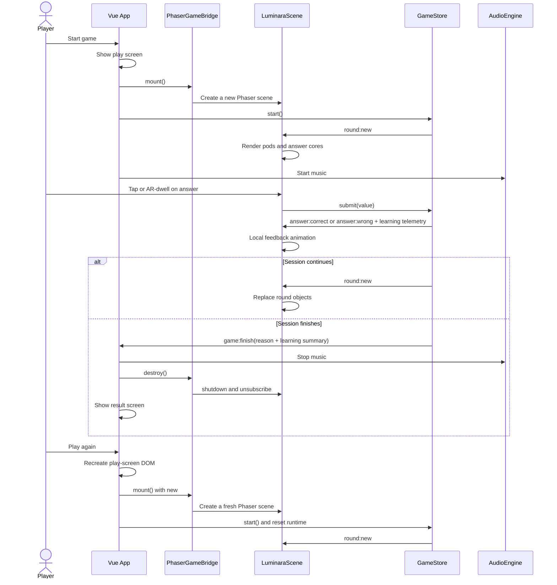
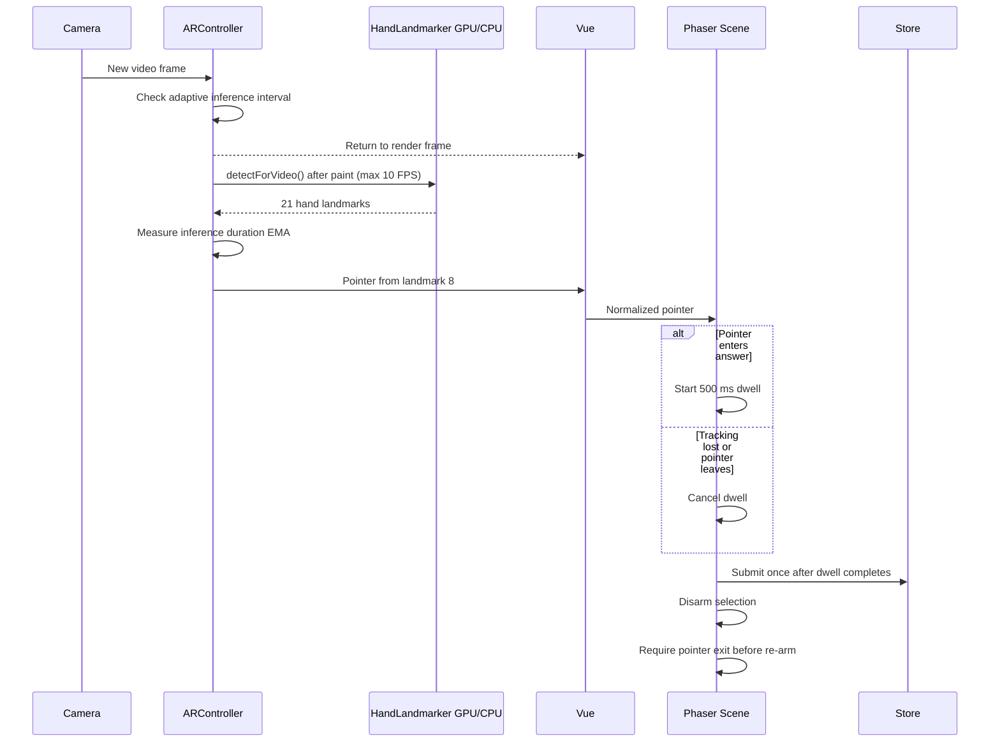
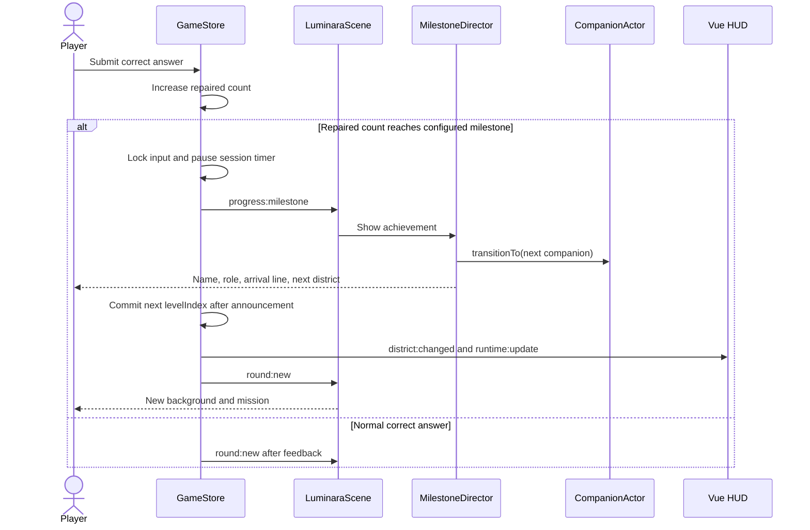

# Runtime Sequence Diagrams

## Start, Answer, Finish, and Play Again

## AR Frame and Dwell Budget

## District Milestone and Character Arrival

## Ownership Rules

- Vue owns screen DOM and destroys Phaser before removing the play screen.
- `PhaserGameBridge` owns the Phaser instance and never reuses a detached canvas.
- `LuminaraScene` owns store subscriptions and removes them on scene shutdown.
- `ARController` owns camera, model, animation frame, and inference timer lifecycle.
- `app.js` owns session-scoped DOM/audio timeout handles and cancels them on finish, replay, or unmount.
- `GameStore` owns `sessionState`, `finishReason`, round timing, and per-pair learning telemetry.
