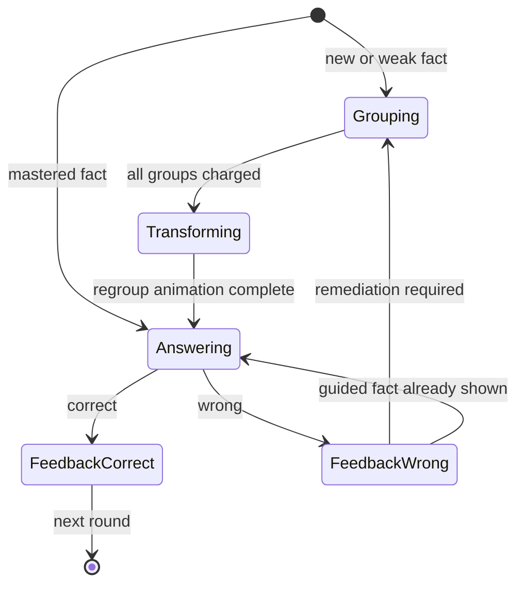
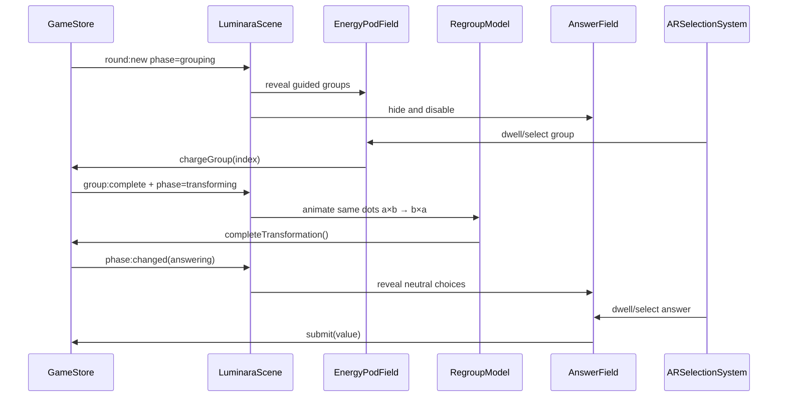

# Adaptive Two-Phase Learning Sprint

## Problem statement

The current screen exposes grouping objects, two commutative diagrams, mascots, and answers at the same time. This creates competing visual hierarchy and allows color/position to distract from mathematical reasoning.

## Learning objective

The learner must be able to explain multiplication as `number of groups × items per group`, then recognize that regrouping the same objects proves `a × b = b × a`.

## Product decisions

1. Use two explicit phases: `grouping` then `answering`, with a short `transforming` bridge.
2. Animate the same dot objects from `a groups of b` to `b groups of a`; never duplicate the total.
3. First exposure and remediation require grouping. Mastered facts may start in answering mode.
4. A wrong fast-track answer returns to guided grouping.
5. Answers use one neutral visual style and equal size. During grouping they remain visible as locked previews, but cannot receive Mouse, Touch or AR input.
6. Only one mascot leads attention in each phase.

## State diagram

## Runtime sequence

## Adaptive rule v1

- Guided when the exact fact has fewer than 2 correct attempts or accuracy is below 80%.
- Fast-track when it has at least 2 correct attempts and accuracy is at least 80%.
- Any wrong fast-track answer triggers guided remediation for the same round.
- Rules live in config and `GameStore`; rendering systems do not infer mastery.

## Acceptance criteria

- During grouping, answer objects are visible with an explicit locked label while AR exposes only group targets.
- During answering, group objects are absent and AR exposes only answer targets.
- The regroup animation reuses exactly `a × b` dots.
- All answer cores have equal size, texture, aura, and idle motion.
- Phase change is announced in the HUD and visually transitioned; the game must never look unloaded.
- Wrong fast-track answers return to grouping without generating a new fact.
- Replay and scene cleanup leave no timers, tweens, or stale targets.
- No JavaScript module exceeds 700 lines; all text files remain UTF-8.

## Sprint Kanban

| ID | Work item | Status |
|---|---|---|
| A2P-01 | Analysis, state diagram, sequence, acceptance criteria | Done |
| A2P-02 | Domain phase state and adaptive policy | Done |
| A2P-03 | Regroup animation using one dot set | Done |
| A2P-04 | Phase-aware Pods, Answers, AR routing | Done |
| A2P-05 | Neutral answer visual system | Done |
| A2P-06 | Mascot phase guidance | Done |
| A2P-07 | Integration, visual and performance QA | Done |
| A2P-08 | Sprint report and document reconciliation | Done |

## Sprint report — 2026-07-31

### Delivered

- Added an explicit `grouping → transforming → answering → feedback` state machine to `GameStore`.
- Added configurable mastery thresholds and fast-track remediation in the SSOT config.
- Replaced two simultaneous diagrams with one set of dots that animates into the swapped grouping.
- Routed Mouse, Touch and AR only to targets belonging to the active learning phase.
- Made all answer objects visually neutral: equal texture, size, aura and motion.
- Added phase-aware poses for Lumin and the active companion.
- Separated active interaction into sequential phases; locked answer previews preserve discoverability without allowing premature guessing.

### Verification evidence

- `npm test`: 7/7 passing, including phase gating, transformation completion, mastery fast track, remediation and replay timer invalidation.
- All JavaScript modules pass `node --check`.
- Browser smoke test confirms the guided round opens on Phase 1 with no answer choices visible and no clipped playfield content.
- Static checks confirm valid JSON, UTF-8 text and JavaScript files under the 700-line limit.

### Residual manual checks

- A physical camera playtest is still required on the final target devices to assess hand landmark confidence, lighting and dwell comfort. The AR routing itself is phase-gated and shares the same selection path as Mouse/Touch.
- Cold loading remains dominated by high-resolution sprite sheets. A later asset-loading sprint should add a visible preload screen and district-based lazy loading.

## Discoverability fix loop — 2026-07-31

- Problem: hiding every answer until all groups were charged made the playfield look incomplete.
- Decision: show all choices from the start as readable locked previews, with the chip `ล็อก • เติมให้ครบ`.
- Unlock: after the same-dot transformation, the lock chips disappear and the choices animate to full size.
- Input safety: locked previews are excluded from Mouse, Touch and AR target resolution.
- Asset correction: a neutral number plate covers the question mark baked into the answer-core artwork, making one- and two-digit values equally readable.
- Verification: 7/7 automated tests pass; browser QA confirmed locked visibility, blocked premature selection, successful phase unlock and zero console errors.
