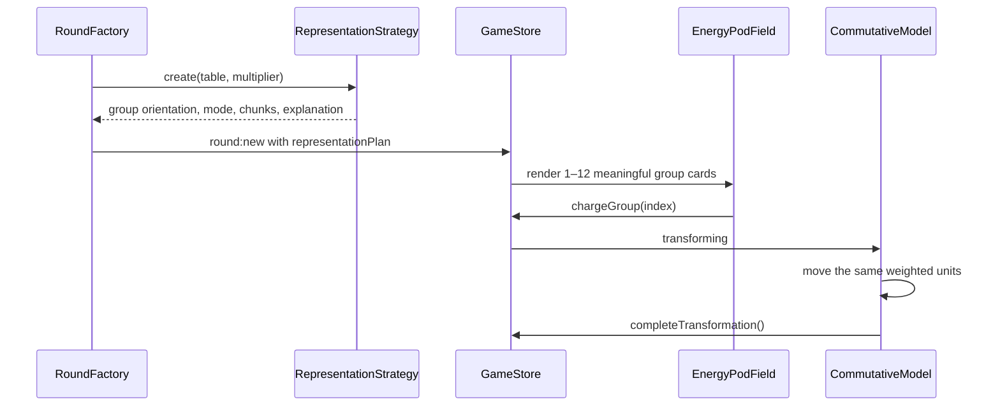

# Tables 13–25 Representation Sprint

## Learner and problem

- Target learners: children aged 8–12.
- The product supports tables 2–25 with the other factor limited to 1–12.
- Rendering 25 separate groups or up to 300 individual dots creates visual noise, counting fatigue and poor mathematical reasoning.

## Learning design decision

The game keeps the question value unchanged but selects a visual representation that limits simultaneous groups to 12 and exposes place value.

| Table | Representation | Example |
|---|---|---|
| 2–12 | Equal groups | `7 groups of 2` |
| 13–19 | Ten plus ones | `6 × 17 = (6 × 10) + (6 × 7)` |
| 20–24 | Two tens plus ones | `8 × 23 = (8 × 20) + (8 × 3)` |
| 25 | Quarter-hundred anchor | Every four groups of 25 become 100 |

For tables above 12, the multiplier becomes the number of visible groups. This uses commutativity without changing the answer: `25 × 12 = 12 × 25`.

## Visual grammar

- Dot: one unit for small quantities.
- Ten bar: ten units.
- Ones cluster: the remaining 1–9 units.
- Group card: one complete group, always labelled by group number and total.
- Hundred battery: four groups of 25 combined into 100.
- No screen renders more than 12 group cards.
- No hidden batch control may silently represent unshown groups.

## State and data flow

## Acceptance criteria

- `7 × 2` remains seven groups of two.
- `17 × 6` renders six groups, each showing `10 + 7`.
- `25 × 12` renders twelve groups, each showing `10 + 10 + 5`.
- The 25-table explanation exposes `4 × 25 = 100`; for 12 groups it exposes three hundreds.
- Correct value and answer generation remain unchanged.
- Group cards never overlap and all 1–12 groups can be selected independently by Mouse, Touch and AR.
- Locked answer previews remain visible throughout grouping.
- No JavaScript file exceeds 700 lines and all project text stays UTF-8.

## Sprint Kanban

| ID | Work item | Status |
|---|---|---|
| R25-01 | Analysis, diagrams and acceptance criteria | Done |
| R25-02 | RepresentationStrategy and SSOT config | Done |
| R25-03 | RoundFactory integration and tests | Done |
| R25-04 | 1–12 group-card layout | Done |
| R25-05 | Place-value glyphs and weighted transformation | Done |
| R25-06 | 25-anchor explanation | Done |
| R25-07 | Automated, visual and interaction QA | Done |
| R25-08 | Report and document reconciliation | Done |

## Sprint report — 2026-07-31

### Delivered

- Added the OOP `RepresentationStrategy` as the single source of visual-orientation rules.
- Added configurable thresholds and anchors under `learning.representation`.
- Updated `RoundFactory` so the mathematical question and answer stay unchanged while the visual grouping can use commutativity.
- Replaced the hidden batch shortcut with a complete selectable layout for 1–12 groups.
- Added compact place-value chips: `10` plus the remaining units.
- Added a weighted-unit transformation instead of rendering up to 300 tiny dots.
- Added the table-25 anchor explanation `4 × 25 = 100` and hundred count.
- Disabled the development vertical slice in production config, allowing the settings range 2–25 to drive rounds.

### Verification

- Automated tests: 10/10 passing.
- Exhaustive representation test: all 288 combinations of tables 2–25 and multipliers 1–12 are exact and bounded to at most 12 visible groups.
- Browser QA for `25 × 12`: twelve non-overlapping `[10][10][5]` cards, locked answer previews, successful unlock, `12 × 25 = 25 × 12`, and `4 × 25 = 100` explanation.
- Browser console: zero errors during the maximum visual case.
- Syntax, JSON, UTF-8 and 700-line module checks pass.
