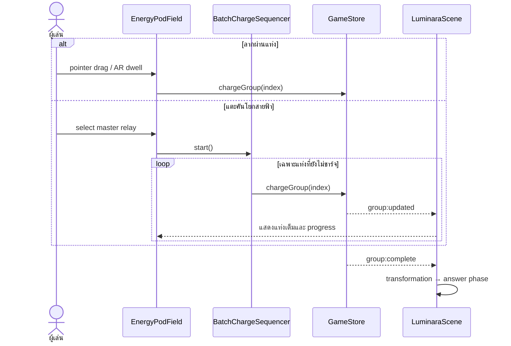

# Dual Charge Interaction

## เป้าหมาย

ลดความรำคาญจากการชาร์จแท่งพลังงานทีละอัน โดยไม่ทำให้เด็กสูญเสียภาพความหมายว่า
`จำนวนกลุ่ม × จำนวนต่อกลุ่ม = จำนวนทั้งหมด`

## รูปแบบการเล่น

1. **ลากผ่านทีละแท่ง** — Mouse/Touch ลากผ่านแท่งพลังงานเพื่อชาร์จต่อเนื่อง และ AR ชี้ผ่านแต่ละแท่งด้วย dwell สั้น
2. **คันโยกสายฟ้า** — Mouse/Touch คลิก หรือ AR เล็งค้างที่คันโยก ระบบจะชาร์จเฉพาะแท่งที่เหลือเรียงทีละกลุ่ม

คันโยกไม่เติมทุกแท่งในเฟรมเดียว แต่ใช้จังหวะ 210 ms ต่อแท่ง เพื่อให้ผู้เล่นยังเห็นการเพิ่มจำนวนกลุ่มและรับ feedback ของแต่ละกลุ่ม

## State flow

## Guardrails

- `GameStore` เป็น SSOT และไม่รับ group index ซ้ำ
- ระหว่าง assisted sequence จะล็อก input ของ field ชั่วคราว
- ยกเลิก sequence เมื่อเปลี่ยนรอบหรือ scene ถูกทำลาย
- คันโยกมี AR dwell 450 ms เพื่อลดการเปิดโดยไม่ตั้งใจ
