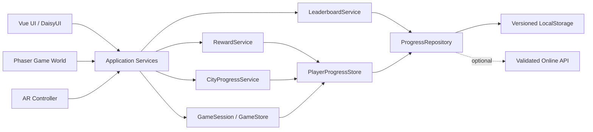
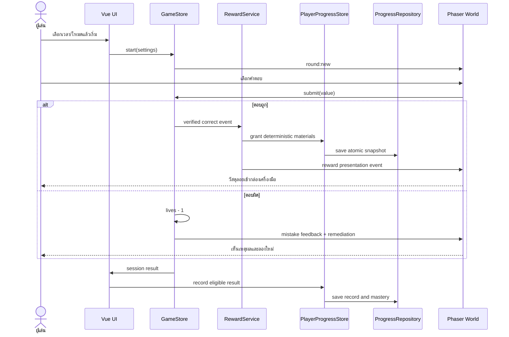

# Progression System Analysis and Implementation Roadmap

วันที่: 2026-08-01  
สถานะ: Analysis and planning complete; local-first scope accepted

## 1. เป้าหมาย

เพิ่มระบบ session 30–600 วินาที, feedback เมื่อตอบผิด, คลังวัสดุซ่อมเมือง, ความก้าวหน้าถาวร และ Hall of Fame โดยยังรักษาเป้าหมายหลักคือการเข้าใจการคูณ ไม่เปลี่ยนเกมให้เป็นการไล่เก็บของหรือแข่งขันด้วยความเร็วเพียงอย่างเดียว

## 2. Current-state analysis

| Capability | Current state | Gap |
|---|---|---|
| Session time | เลือกเวลาและนับถอยหลังได้ | ปรับเป็น 30–600 วินาทีแล้ว ต้องเพิ่ม preset UX |
| Wrong answer | ลดหัวใจ 1, reset combo, adaptive remediation | ต้องเพิ่ม visual feedback และ practice policy |
| Repair reward | แสดง reward animation และนับ repaired nodes | ยังไม่มี inventory ถาวรหรือกฎแจกวัสดุแบบ SSOT |
| City progress | เปลี่ยน district ตามจำนวน repairs | ยังไม่มี restored-object state และ before/after persistence |
| Player save | ไม่มี | ต้องมี repository, schema version และ migration |
| Hall of Fame | มี runtime artwork แล้ว | ยังไม่มี score policy, local board หรือ online service |
| Learning history | เก็บใน session memory | ยังไม่บันทึก mastery ข้าม session |

## 3. Product rules

### 3.1 Time

- ผู้เล่นเลือก 30–600 วินาที เพิ่มทีละ 30 วินาที
- ปุ่ม preset: 60, 180, 300 และ 600 วินาที
- ระดับความยากห้ามเปลี่ยนเวลาที่เลือก
- การเปิดกล้องและ milestone transition ต้องหยุดเวลาอย่างถูกต้อง

### 3.2 Mistakes and hearts

- Challenge mode: เริ่ม 5 หัวใจ ตอบผิดลด 1 หัวใจ และจบ session เมื่อหมด
- Practice mode: แสดงหัวใจเป็นพลังทีม แต่ไม่จบ session; คงขั้นต่ำที่ 1 และให้ remediation ต่อ
- ตอบผิดต้องไม่หักวัสดุสะสมและไม่ลบความก้าวหน้าที่ทำไว้
- Feedback sequence: lock input → heart drain → gentle reaction → show reasoning scaffold → retry

### 3.3 Deterministic repair rewards

หลีกเลี่ยง loot box และ random reward ที่ไม่สัมพันธ์กับการเรียนรู้

| Event | Reward |
|---|---|
| ตอบถูกและซ่อม node สำเร็จ | Gear +1 |
| ตอบถูก 3 ครั้งโดยรักษาความแม่นยำอย่างน้อย 80% | Crystal +1 |
| Combo 5 | Energy Cell +1 |
| Master คู่สูตรคูณใหม่ตาม adaptive policy | Prism +1 |

Reward event ต้องมี idempotency key เพื่อป้องกัน replay callback แจกซ้ำ

### 3.4 City restoration

- แต่ละ district มี restoration nodes 4 จุด
- Node ใช้วัสดุที่ระบุใน config และมี state `locked`, `available`, `restored`
- เมืองต้องเปลี่ยนภาพอย่างมองเห็นได้ เช่น เปิดไฟ ซ่อมสะพาน หมุนเฟือง หรือฟื้นสวน
- การซ่อมเมืองเป็นผลจากการเรียนรู้ ไม่ใช่การใช้วัสดุแบบสุ่ม

### 3.5 Hall of Fame fairness

- Local Hall of Fame เก็บ Top 10 บนอุปกรณ์ได้โดยไม่ใช้ backend
- Online Hall of Fame ต้องมี authentication, database, validation และ abuse protection
- ห้ามจัดอันดับด้วยคะแนนดิบข้ามเวลาที่ต่างกัน เพราะรอบ 600 วินาทีได้เปรียบรอบ 30 วินาที
- Leaderboard key ขั้นต่ำ: mode + duration + table range + difficulty
- เพิ่ม Personal Best และ Mastery Board เพื่อให้เด็กแข่งกับความก้าวหน้าของตนเอง

## 4. Target architecture



### Ownership

- `GameStore`: runtime session, timer, lives, round and learning phase only
- `PlayerProgressStore`: profile, inventory, mastery, city and records
- `RewardService`: converts verified domain events into deterministic rewards
- `CityProgressService`: validates costs and restoration transitions
- `LeaderboardService`: builds fair board keys and records eligible results
- `ProgressRepository`: serialization, schema validation, migration and recovery
- `RewardPresenter`: presentation only; never grants inventory itself

Pinia เหมาะสำหรับ `PlayerProgressStore` และ global UI state ส่วน domain classes ยังคงเป็น OOP เพื่อให้ทดสอบกฎเกมโดยไม่ต้องเปิด Vue หรือ Phaser

## 5. Data model

```json
{
  "schemaVersion": 1,
  "player": {
    "id": "local-uuid",
    "displayName": "นักซ่อมแสง",
    "createdAt": "ISO-8601",
    "updatedAt": "ISO-8601"
  },
  "preferences": {
    "seconds": 180,
    "mode": "challenge",
    "tableMin": 2,
    "tableMax": 12,
    "difficulty": "adventure"
  },
  "inventory": {
    "gear": 0,
    "crystal": 0,
    "energyCell": 0,
    "prism": 0
  },
  "city": {
    "districts": {}
  },
  "mastery": {},
  "records": [],
  "processedRewardEvents": []
}
```

`processedRewardEvents` เก็บแบบ bounded list เพื่อป้องกัน event ซ้ำโดยไม่ทำให้ save โตไม่จำกัด ส่วน session history เก็บเฉพาะ summary ล่าสุดและ aggregate mastery

## 6. Core sequence



## 7. Agile Kanban delivery plan

### Sprint P1 — Persistence foundation

| Card | Work | Acceptance |
|---|---|---|
| P1-01 | Define schema and config | JSON schema has version and bounded collections |
| P1-02 | Implement `ProgressRepository` | load/save/reset/migrate/corrupt-save recovery tested |
| P1-03 | Add Pinia `PlayerProgressStore` | UI observes inventory and city without coupling to Phaser |
| P1-04 | Save preferences and mastery | reload restores valid data |
| P1-05 | Automated lifecycle tests | replay cannot duplicate rewards |

### Sprint P2 — Hearts and material economy

| Card | Work | Acceptance |
|---|---|---|
| P2-01 | Add practice/challenge mode | heart behavior matches selected mode |
| P2-02 | Implement `RewardService` | rewards follow config and idempotency rules |
| P2-03 | Material HUD/toolbox | inventory is readable without covering playfield |
| P2-04 | Wrong-answer presentation | no harsh feedback; remediation remains clear |
| P2-05 | Reward animation integration | animation and stored reward never disagree |

### Sprint P3 — City restoration

| Card | Work | Acceptance |
|---|---|---|
| P3-01 | Add district/node config | all costs and unlocks are SSOT |
| P3-02 | Implement `CityProgressService` | invalid spend and duplicate repair are rejected |
| P3-03 | Build restoration screen/map | before/after state is visually obvious |
| P3-04 | Connect milestones and characters | narrative explains each unlocked repair |
| P3-05 | Save/load and responsive QA | works on desktop/mobile without clipped content |

### Sprint P4 — Local Hall of Fame

| Card | Work | Acceptance |
|---|---|---|
| P4-01 | Define eligibility and board key | different durations are not compared unfairly |
| P4-02 | Implement Top-10 local repository | stable sorting and duplicate handling tested |
| P4-03 | Build Hall scene from processed assets | podium, frames and VFX load without black halo |
| P4-04 | Add Personal Best/Mastery tabs | child sees personal improvement even without rank |
| P4-05 | Accessibility/performance QA | keyboard, touch, mouse and reduced motion supported |

### Sprint P5 — Optional online Hall of Fame

ดำเนินการเฉพาะเมื่อยืนยันว่าจะมี backend และนโยบายข้อมูลเด็ก โดยต้องเพิ่ม server-side score validation, rate limiting, moderation ของชื่อ, privacy notice และการลบข้อมูล

## 8. Test strategy

- Unit: reward rules, heart policy, score key, repository migration, restoration costs
- Integration: correct/wrong → inventory → save → reload
- Lifecycle: replay, quit, timeout and stale callback do not duplicate rewards
- Visual: 1366×768, 1920×1080, mobile landscape and AR overlay
- Accessibility: mouse, touch, AR, keyboard fallback and reduced motion
- Performance: save is debounced/atomic and does not run every animation frame

## 9. Decisions and assistance required

### Required before Sprint P3

1. ยืนยันว่าจะใช้ภาพเมืองเดิมแล้วเพิ่ม overlay ซ่อมแซม หรือสร้างภาพ before/after แยกสำหรับแต่ละ district
2. หากต้องการภาพ before/after ให้จัดทำอย่างน้อย district แรก 4 จุด โดยคงกล้องและ layout เดิมทุกภาพ

### Required before Sprint P4

3. ชื่อผู้เล่น: ให้เด็กพิมพ์ชื่อเอง หรือเลือกชื่อเล่นสำเร็จรูปเพื่อความปลอดภัย

### Required only for Sprint P5

4. เลือก local Hall of Fame หรือ online Hall of Fame
5. หากเป็น online ต้องเลือก backend/hosting และยืนยันนโยบายเก็บข้อมูลผู้เล่นเด็ก

### Not required from the user

- การเขียน repository, Pinia store, services, migration และ tests
- การประกอบ Hall of Fame จาก asset ที่มีแล้ว
- การทำ material HUD, feedback animation และ responsive layout
- การ normalize/crop/alpha/pivot ของ artwork ที่ส่งมา

## 10. Recommended defaults

หากไม่ระบุเพิ่มเติม ให้ใช้ค่าเริ่มต้นดังนี้:

- Challenge mode เป็นค่าเริ่มต้น และมี Practice mode ให้เลือก
- Local Hall of Fame ก่อน online
- ชื่อเล่นสำเร็จรูป + avatar frame เพื่อลดความเสี่ยงข้อมูลเด็ก
- ใช้ฉากเดิมกับ code-driven repair overlays ใน vertical slice แรก
- วัสดุไม่สูญหายเมื่อตอบผิด

## 11. Confirmed product decisions

- City restoration: use the existing district background with progressive transparent overlays. Each restored object appears independently, allowing four visible repair steps without replacing the whole scene.
- Player identity: allow a typed display name with a 12-character limit, safe fallback name, local UUID, and validation separated from future server-side moderation.
- Hall of Fame: implement local storage first through a `LeaderboardRepository` port. A future online adapter will implement the same interface. See `docs/adr/ADR-005-progress-and-leaderboard-ports.md`.
