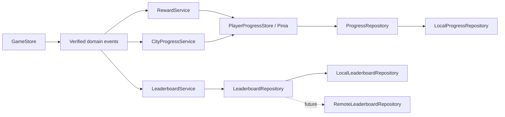

# Progression Implementation Report

วันที่: 2026-08-01  
สถานะ: Sprint P1–P4 Done; P5 Online Adapter deferred by product decision

## Delivered scope

### P1 — Persistence foundation

- Added Pinia as the global durable-progress store.
- Added versioned `ProgressRepository` and local-storage adapter.
- Added corrupt-save recovery, bounded records, player UUID, preferences, inventory, city state and mastery persistence.
- Added safe display-name policy with a 12-character limit.
- Hydrates mastery before the first round of every new session.

### P2 — Hearts and material economy

- Added exact 30–600 second selection with 1, 3, 5 and 10 minute presets.
- Added Challenge and Practice modes.
- Challenge ends when five hearts are consumed; Practice stays at one heart and continues remediation.
- Added gentle heart-drain animation.
- Added deterministic Gear, Crystal, Energy Cell and Prism rewards.
- Reward event IDs prevent duplicate inventory grants after replay or stale callbacks.

### P3 — City restoration

- Added four persisted restoration nodes per district.
- Added code-driven lamp, gear, bridge and beacon overlays.
- Added a compact material inventory to the play HUD.
- Restoration state survives reloads and does not consume or remove materials on mistakes.

### P4 — Local Hall of Fame

- Added `LeaderboardRepository` port and `LocalLeaderboardRepository` adapter.
- Added fair board keys partitioned by mode, selected duration, table range and difficulty.
- Added stable Top-10 sorting and session deduplication.
- Added Hall of Fame scene using the supplied normalized background, podiums and avatar frames.
- Added safe typed player names and Personal ID separation.
- The contract is ready for a future remote adapter without UI or game-rule changes.

## Architecture

## Files added

- `js/progression/ProfilePolicy.js`
- `js/progression/ProgressStore.js`
- `js/progression/RewardService.js`
- `js/progression/CityProgressService.js`
- `js/progression/LeaderboardService.js`
- `js/progression/repositories/ProgressRepository.js`
- `js/progression/repositories/LocalProgressRepository.js`
- `js/progression/repositories/LeaderboardRepository.js`
- `js/progression/repositories/LocalLeaderboardRepository.js`
- `tests/progression.test.mjs`

## QA evidence

- JavaScript syntax checks: Pass.
- Automated tests: 27 passing, including session-settings integrity and city progression.
- Browser CDN/bootstrap: Pass.
- Pinia profile save and reload: Pass.
- Settings modal at 1280×720: Pass without clipped controls.
- Start screen at 844×390: no horizontal overflow.
- Gameplay startup with persisted Pinia proxy data: Pass.
- Hall of Fame empty state and artwork: Pass.
- Browser console after final startup: no warning or error.

## Deferred scope

Online Hall of Fame remains intentionally deferred. The future adapter must add server-side score validation, name moderation, rate limiting, authentication/privacy policy and player-data deletion. Local progress remains authoritative and must survive remote-service failure.
