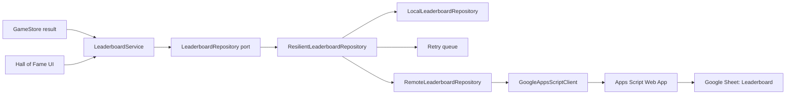
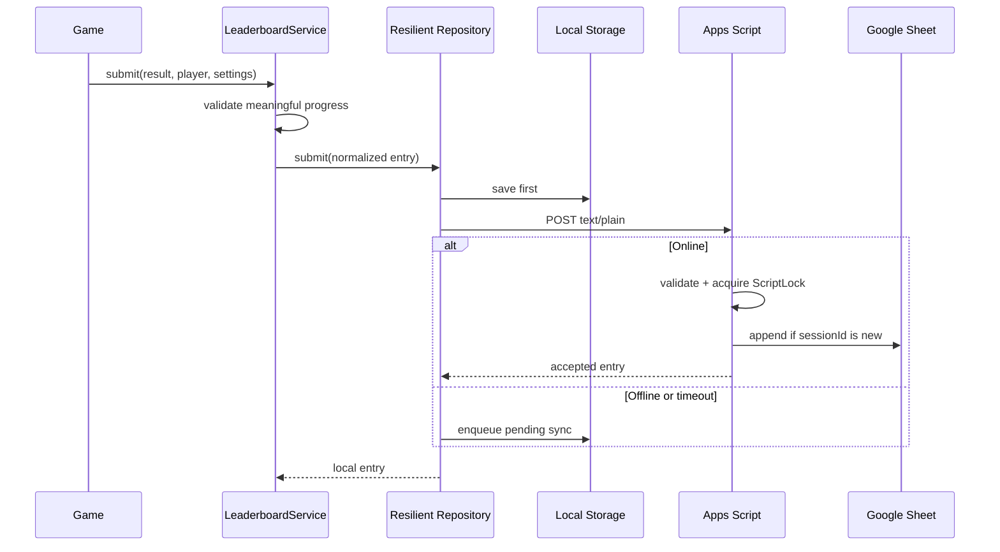

# Google Sheets Online Leaderboard

วันที่: 2026-08-02  
สถานะ: Client และ Apps Script พร้อมติดตั้ง; รอ Web App deployment URL

## เป้าหมาย

- บันทึก Hall of Fame ลง Google Sheet โดยไม่ทำคะแนนในเครื่องสูญหาย
- Local-first: เขียน `localStorage` ก่อน แล้ว sync ออนไลน์ภายหลัง
- ป้องกัน session ซ้ำด้วย `sessionId`
- แยก Service, Port, Adapter และ composition namespace เพื่อทดสอบและเปลี่ยน backend ได้ง่าย
- ไม่เก็บอีเมล IP หรือข้อมูลระบุตัวเด็ก เก็บเพียงชื่อเล่นที่ผ่านการกรองและรหัสสุ่มในเครื่อง

## สถาปัตยกรรม

`LeaderboardInfrastructure` เป็น namespace composition root จุดเดียวที่เลือก adapter จาก config ถ้าภายหลังเปลี่ยนเป็น Supabase ให้เพิ่ม adapter ใหม่และเปลี่ยนเฉพาะ factory นี้

## ลำดับการบันทึก

## ติดตั้ง Google Apps Script

Script ID: `1v9zbl8aqAjWJRmdFGvv2vj-I7ffrLwKpcRjpJPzwsfyVBFc0XlzB10rm`

1. เปิด Apps Script project จาก Script ID นี้
2. สร้างไฟล์และคัดลอกเนื้อหาจากโฟลเดอร์ `google-apps-script`:
   - `Config.gs`
   - `EntryPolicy.gs`
   - `SheetRepository.gs`
   - `Api.gs`
   - `Code.gs`
3. เปิด Project Settings และแสดงไฟล์ manifest จากนั้นใช้ `appsscript.json` ที่เตรียมไว้
4. เลือกฟังก์ชัน `setupLeaderboard` แล้วกด Run หนึ่งครั้ง
5. อนุญาตให้ Script เข้าถึง Spreadsheet
6. ไปที่ **Deploy → New deployment → Web app**
7. ตั้ง **Execute as: Me** และ **Who has access: Anyone**
8. กด Deploy แล้วคัดลอก URL ที่ลงท้ายด้วย `/exec`
9. ใส่ URL ใน `config/game.config.json` ที่ `leaderboard.online.webAppUrl`
10. เปิด `<WEB_APP_URL>?action=health` ต้องได้รับ JSON ที่มี `"ok":true`

Script ID ไม่ใช่ Web App URL และไม่สามารถใช้แทน URL `/exec` ได้

## Schema ใน Sheet `Leaderboard`

| Column | ความหมาย |
|---|---|
| schemaVersion | รุ่นข้อมูล |
| submittedAt | เวลาจาก server |
| boardKey | โหมด/เวลา/ช่วงแม่/ระดับ |
| sessionId | ป้องกันการบันทึกซ้ำ |
| playerId | UUID ในเครื่อง ไม่ใช่ชื่อเด็ก |
| displayName | ชื่อเล่นที่กรองแล้ว สูงสุด 12 ตัวอักษร |
| score | ดาวที่ผู้เล่นเห็นในเกม |
| accuracy | คำนวณใหม่บน server |
| correctAnswers | จำนวนตอบถูก |
| totalAnswers | จำนวนตอบทั้งหมด |
| elapsedSeconds | เวลาเล่นจริง 1–600 วินาที |
| repaired | จำนวนจุดที่ซ่อมสำเร็จ |

## ความถูกต้องและความปลอดภัย

- Server คำนวณ accuracy ใหม่และตรวจ `correctAnswers <= totalAnswers`
- ตรวจคะแนนไม่เกินเพดานกติกา `7 × correctAnswers`
- ป้องกันชื่อแบบ URL หมายเลขโทรศัพท์ control characters และ spreadsheet formula
- ใช้ `LockService.getScriptLock()` ป้องกันการเขียนชนกัน
- session เดิมตอบกลับข้อมูลเดิมและไม่เพิ่มแถวซ้ำ
- จำกัด Sheet 10,000 รายการและคืน Top 10 ต่อ board
- Public Apps Script ช่วยกันข้อมูลเสียรูปได้ แต่ยังไม่ใช่ anti-cheat ที่สมบูรณ์ เพราะ client เป็นเว็บสาธารณะ หากต้องการแข่งขันจริงควรใช้ backend ที่ออก signed session token

## Contract และ fallback

- ถ้ายังไม่มี deployment URL ระบบใช้ Local Hall of Fame ตามเดิม
- ถ้าส่งออนไลน์ล้มเหลว คะแนนยังอยู่ในเครื่องและเข้าคิวสูงสุด 100 session
- เมื่อเปิด Hall of Fame ครั้งถัดไป ระบบลอง sync queue ใหม่
- รายการออนไลน์และรายการที่ยังรอ sync จะ merge ด้วย `sessionId` ก่อนจัดอันดับ

## การทดสอบ

`tests/online-leaderboard.test.mjs` ครอบคลุม:

- CORS-simple POST
- local-first เมื่อออฟไลน์
- retry queue และการ sync เมื่อกลับมาออนไลน์
- ปฏิเสธ response ที่เสียรูป
- fallback เป็น Local adapter เมื่อยังไม่มี deployment URL

