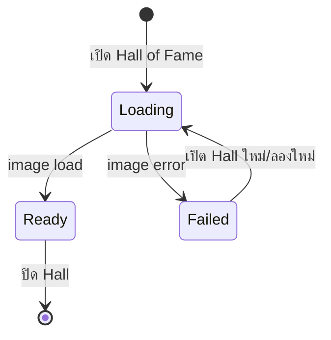

# Hall of Fame Scene Loading Lifecycle

วันที่: 2026-08-02

## ปัญหา

ขณะเปิด Hall of Fame เบราว์เซอร์อาจวาด CSS spotlight และแสงพื้นเวทีก่อนดาวน์โหลดภาพฉากขนาดใหญ่เสร็จ ผู้เล่นจึงเห็นพื้นสีน้ำเงินว่างกับแสงสามจุดชั่วคราว ซึ่งดูเหมือนเกมเสียและไม่มีความหมาย

## สาเหตุ

- ฉากเดิมถูกโหลดผ่าน `background-image` ของ CSS จึงไม่มี lifecycle event ที่ Vue ใช้ควบคุมได้โดยตรง
- เอฟเฟกต์ตกแต่งและเหรียญถูก render โดยไม่รอสถานะของภาพฉาก
- ไม่มี loading/error state ที่สื่อสารกับผู้เล่น

## การออกแบบใหม่

- `Loading`: แสดงข้อความ “กำลังเปิดม่านหอเกียรติยศ…” และ loader ที่มีความหมายกับโลกเกม
- `Ready`: fade-in ภาพฉาก แล้วจึง render spotlight, camera flash และเหรียญ
- `Failed`: แสดงข้อความแจ้งปัญหาแทนฉากว่าง
- preload ภาพ Hall ตั้งแต่หน้าเริ่ม เพื่อลดเวลารอ
- path ของภาพอยู่ใน SSOT `config.assets.hallOfFame.background`

## Acceptance criteria

- ไม่เห็น spotlight หรือเหรียญบนพื้นหลังว่าง
- Hall แสดงภาพฉากก่อนเริ่มเอฟเฟกต์
- ถ้าภาพโหลดไม่ได้ ผู้เล่นได้รับข้อความที่เข้าใจได้
- เปิด Hall ซ้ำได้โดยไม่ค้างสถานะเดิม
- console ไม่มี error และ automated tests ผ่านทั้งหมด

## Verification

- `node --check js/app.js`: ผ่าน
- parse `config/game.config.json`: ผ่าน
- automated tests: 43/43 ผ่าน
- browser visual QA ที่ `http://127.0.0.1:8025/`: ฉากและเหรียญแสดงครบ, console error 0
