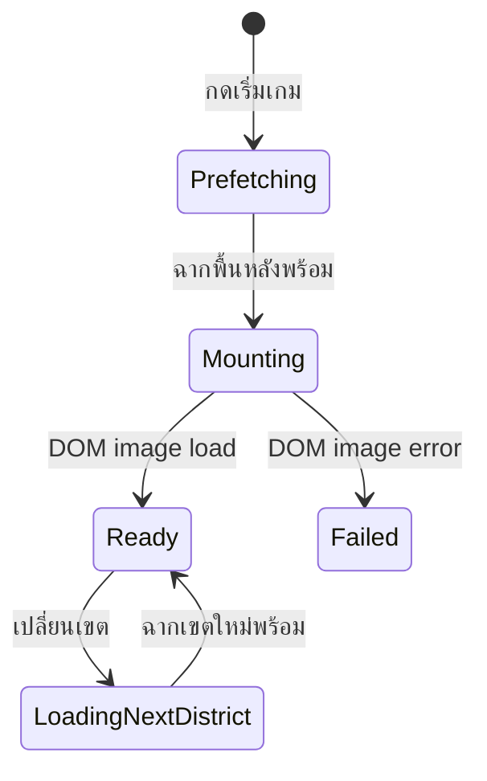

# Kanban — Play Scene Loading Lifecycle

วันที่: 2026-08-02

## Root cause

ภาพที่มีแสงสองดวง เสาแสงกลาง และวงรีด้านล่างไม่ใช่ loading screen แต่เป็นชั้น `city-restoration` ขั้น 1–4 ที่ถูก render บนพื้นสีน้ำเงินก่อนภาพฉากเล่นโหลดเสร็จ

## Workflow

## Kanban

| Card | งาน | สถานะ |
|---|---|---|
| PSL-01 | Trace ชั้นภาพที่ปรากฏก่อนฉากเล่น | Done |
| PSL-02 | Prefetch ภาพพื้นหลังก่อนเปลี่ยนจากหน้าเริ่ม | Done |
| PSL-03 | เพิ่มสถานะ ready/failed ของ play scene | Done |
| PSL-04 | ล็อก city-restoration จนกว่าภาพฉากพร้อม | Done |
| PSL-05 | เพิ่ม loading UI ที่สื่อความหมายกับโลกเกม | Done |
| PSL-06 | ป้องกันการกดเริ่มเกมซ้ำระหว่างเตรียมฉาก | Done |
| PSL-07 | Automated tests 44/44 และ browser lifecycle QA | Done |

## Verification

- ระหว่างโหลดไม่แสดง repair overlays บนฉากว่าง
- หลังโหลดแสดงฉาก เกม และ HUD ครบ
- console error: 0
- automated tests: 44/44 ผ่าน
