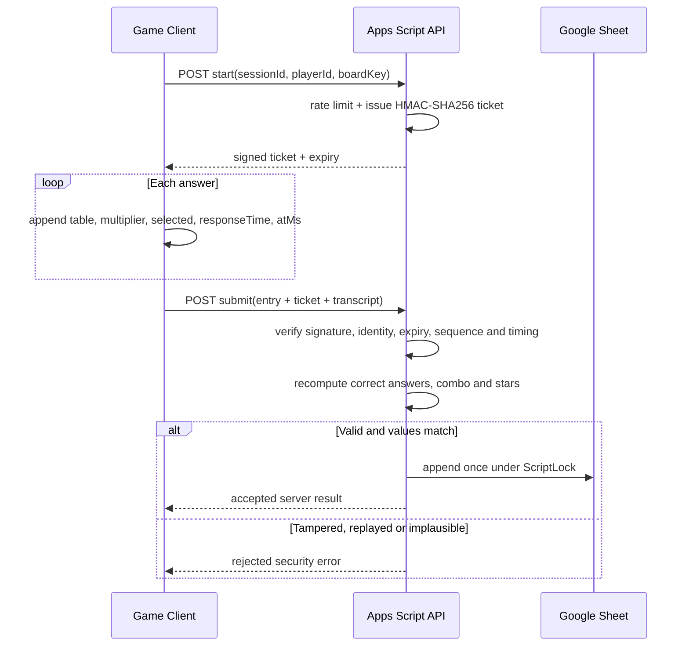

# Worldwide Leaderboard Anti-Cheat Architecture

วันที่: 2026-08-02  
สถานะ: Live — authorized, deployed, connected to the game, and verified end to end

## Security principle

Browser เป็น untrusted client เสมอ ระบบโลกออนไลน์จึงไม่เชื่อ `score`, `correctAnswers`, `elapsedSeconds`, `accuracy` หรือ `sessionId` ที่ browser ส่งมา แต่คำนวณผลใหม่ใน Apps Script จากหลักฐานการเล่น

## Protocol

## Controls implemented

- HMAC-SHA256 session ticket; secret stored only in Script Properties
- Ticket binds `sessionId`, `playerId`, `boardKey`, issue time, expiry and nonce
- Ticket lifetime 15 minutes, covering the maximum 10-minute game
- Every answer records sequence, multiplication pair, selected value and timing
- Server recomputes multiplication answers and combo-based stars
- Server rejects altered score/count/repair totals
- Server rejects impossible answer frequency and questions outside the selected board
- Script Cache best-effort rate limiting for start and submit
- Script Lock plus session ID deduplication prevents duplicate sheet rows
- Entries without signed proof remain local-only and never enter the worldwide board
- Names are sanitized against formulas, URLs, control characters and phone-like values

## Threats and residual risk

| Threat | Control | Residual risk |
|---|---|---|
| Edit score in DevTools | Server recomputation | Prevented |
| Direct POST with invented totals | Signed ticket + transcript | Prevented |
| Replay a valid submission | Session ID deduplication | Prevented from duplicate ranking |
| Bot solves real multiplication automatically | Timing/rate/anomaly rules | Can be reduced, not eliminated in a browser game |
| Distributed abuse with many player IDs | Apps Script quotas and rate cache | Requires Cloud Armor/Firebase App Check at larger scale |
| Apps Script/Sheets quota exhaustion | Local-first fallback | Worldwide ranking may become temporarily unavailable |

## Scale recommendation

Google Sheets + Apps Script is appropriate for MVP, classroom and moderate public traffic. For sustained worldwide traffic, migrate the same repository interface to Cloud Run/Functions + Firestore and add App Check, device attestation, centralized rate limiting and an admin moderation console. Apps Script quotas are finite and can change.

## Live acceptance result

- Deployment health: `ok`, schema version 2
- Tampered score: rejected with `SCORE_PROOF_MISMATCH`
- Valid signed score proof: accepted and visible through the leaderboard read API
- Client configuration: verified Apps Script `/exec` URL enabled
- Regression result: 51/51 tests passed

## Official references

- HMAC and cryptographic utilities: https://developers.google.com/apps-script/reference/utilities/utilities
- Script Properties: https://developers.google.com/apps-script/reference/properties/properties-service
- Lock Service: https://developers.google.com/apps-script/reference/lock
- Cache Service: https://developers.google.com/apps-script/reference/cache/cache-service
- Web App access/executeAs manifest: https://developers.google.com/apps-script/manifest/web-app-api-executable
- Apps Script quotas: https://developers.google.com/apps-script/guides/services/quotas
