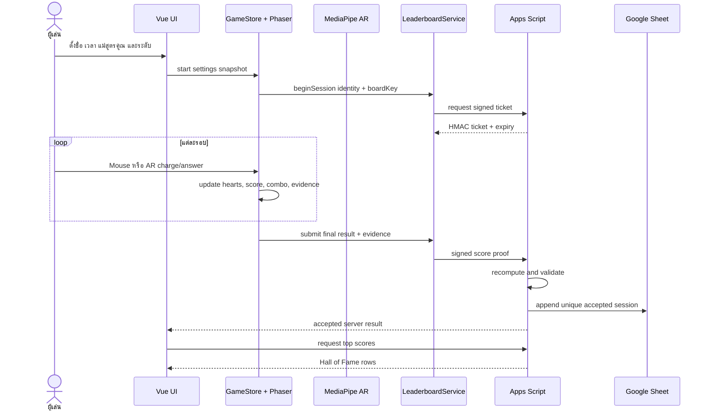

# Workflow Test Strategy — เมืองแสงซ่อนกล

วันที่: 2026-08-02  
ขอบเขต: เกมสูตรคูณ 2–25, Mouse, AR, Google Apps Script, Google Sheet และ Hall of Fame

## เป้าหมาย

พิสูจน์ว่า workflow ตั้งแต่ผู้เล่นตั้งค่า เริ่มเกม เรียนรู้ ตอบคำถาม จบเซสชัน ส่งหลักฐานคะแนน และอ่านอันดับกลับมา ทำงานสอดคล้องกัน โดยคะแนนที่แสดงในเกมต้องตรงกับคะแนนที่ server ยอมรับ

## Workflow ภายใต้การทดสอบ

## ระดับการทดสอบ

| ระดับ | สิ่งที่ตรวจ | วิธี |
|---|---|---|
| Unit | สูตรคูณ, distractor, hearts, combo, score proof | Node test runner |
| Integration | Store, repository, ticket binding, replay lifecycle | Node test runner |
| Static | JSON, UTF-8, asset paths, module size, cache version | QA script/PowerShell |
| API Security | health, signed ticket, tamper, valid proof, duplicate | Apps Script `/exec` |
| E2E UI | start → play → result → Hall of Fame → replay | Browser automation + visual inspection |
| AR | permission, hand detection, pointer, dwell selection | Automated logic + manual camera acceptance |

## Test matrix และเกณฑ์ผ่าน

| ID | กรณีทดสอบ | เกณฑ์ผ่าน |
|---|---|---|
| WF-01 | โหลดหน้าเริ่มต้น | ไม่มี runtime error และมีปุ่มเริ่มเกม/ตั้งค่า |
| WF-02 | ตั้งชื่อและเวลา 30–600 วินาที | settings snapshot ตรงค่าที่เลือก |
| WF-03 | เริ่มเซสชัน | ได้ signed ticket ที่ผูก session/player/board |
| WF-04 | เล่นด้วย Mouse | charge และเลือกคำตอบได้เพียงครั้งต่อ action |
| WF-05 | ตอบผิด | หัวใจลดหนึ่ง, combo reset, ไม่เพิ่ม mastery |
| WF-06 | ตอบถูก | score/evidence เพิ่ม และเปลี่ยนรอบครั้งเดียว |
| WF-07 | AR pointer | แสดงเฉพาะนิ้วชี้และ dwell เลือก target ได้ |
| WF-08 | จบด้วยเวลา/หัวใจ | result ถูกสร้างครั้งเดียวและ replay ได้ |
| WF-09 | ส่งคะแนนจริง | server คำนวณใหม่และ Sheet รับข้อมูลตรงกัน |
| WF-10 | ดัดแปลงคะแนน | server ปฏิเสธ `SCORE_PROOF_MISMATCH` |
| WF-11 | ส่ง session ซ้ำ | ไม่เกิดแถวอันดับซ้ำ |
| WF-12 | Hall of Fame | อ่านอันดับ board เดียวกันและเรียงตามกติกา |
| WF-13 | API/อินเทอร์เน็ตล้มเหลว | เกมจบได้และ fallback local โดยไม่ปลอมว่า sync สำเร็จ |
| WF-14 | เล่นอีกครั้ง | ไม่มี scene/resource/session เก่าค้าง |
| WF-15 | Responsive layout | ไม่มี content สำคัญถูก clip หรือ double scrollbar |

## Severity

- Blocker: เริ่ม/เล่น/จบเกมไม่ได้, คะแนนปลอมผ่าน, ข้อมูลเสียหาย
- High: คะแนนไม่ตรง, replay ค้าง, AR เลือกไม่ได้
- Medium: fallback/ข้อความ/ลำดับ UI ทำให้สับสน
- Low: visual polish, spacing หรือ animation ไม่กระทบการเล่น

## Exit criteria

- Automated tests ผ่าน 100%
- Health, signed ticket, tamper rejection และ valid Sheet write ผ่าน
- Workflow หลัก Mouse ผ่านตั้งแต่เริ่มจน replay
- ไม่มี Blocker หรือ High ที่ยังไม่ถูกบันทึกพร้อมแนวทางแก้
- AR logic ผ่านอัตโนมัติ; camera acceptance ที่ต้องใช้มนุษย์ถูกแยกเป็น manual test อย่างชัดเจน

