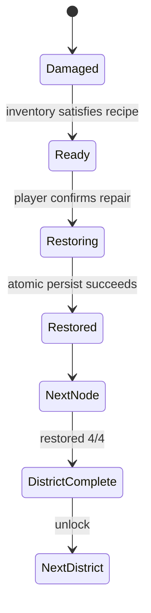

# Release Readiness Program

วันที่เริ่ม: 2026-08-02  
เป้าหมาย: เปลี่ยนสถานะจาก Conditional Pass เป็น evidence-based Go/No-Go สำหรับ public beta และ worldwide production

## Release gates

| Gate | Acceptance criteria | Automation | Human acceptance |
|---|---|---|---|
| RG-01 City progression | ผู้เล่นเห็น 4 จุดซ่อม, ใช้วัสดุจริง, state persist, เขตถัดไป unlock | Unit + browser E2E | เด็กอธิบายได้ว่าเล่นต่อเพื่อซ่อมอะไร |
| RG-02 AR | startup, no-hand, index-only, dwell once, mirror, recover | Unit + diagnostics | มือจริงบน Windows/Android phone/tablet |
| RG-03 Hall/UI | ไม่ซ้อน, มี loading state, ไม่มี horizontal overflow | Static + browser viewports | Visual sign-off |
| RG-04 Operations | repeatable load test, health monitor, latency/error thresholds | CLI scripts | Observe production dashboard |
| RG-05 Moderation/data | name policy, report/hide/delete workflow, retention | Unit + API smoke | Admin-owner approval |
| RG-06 Child privacy | data inventory, notice, parental/teacher path, deletion contact | Document checklist | Legal/privacy owner approval |
| RG-07 Release | regression, API, browser, rollback and deployment checklist | CI-like local suite | Product owner Go decision |

## City restoration contract

- Correct answers grant materials but never mutate city state directly.
- Repair requires an explicit player action on the city screen.
- Inventory deduction and node restoration are one persistence transaction.
- Nodes must be repaired in story order to keep the goal understandable.
- A district background visually progresses from desaturated/dim to bright.
- Reload and Play Again preserve city state and active district.

## Release classes

- Development: local team only
- Closed Beta: invited users, monitored, no production claim
- Public Beta: privacy notice and support path published, load ceiling known
- Worldwide Production: all automated gates pass plus AR-device, privacy/legal and product-owner approvals

