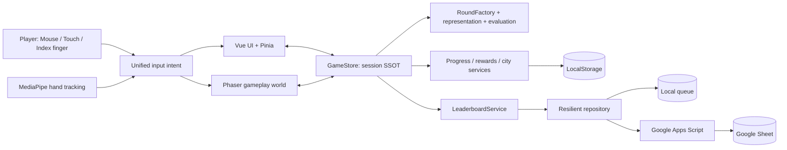
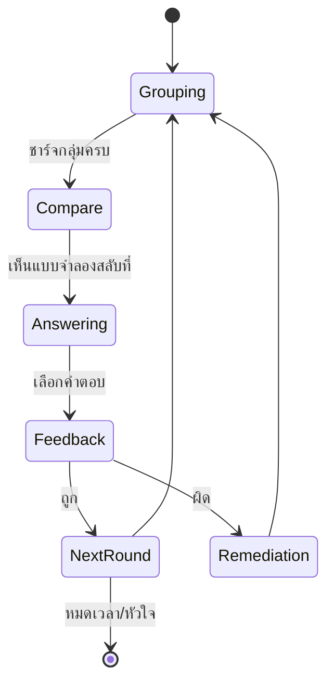

# Project Closeout Report — เมืองแสงซ่อนกล

วันที่ปิดรอบพัฒนา: 2026-08-02  
สถานะผลิตภัณฑ์: Public web demo / monitored beta  
สถานะ Worldwide Production: ยังไม่ผ่าน Release Gate ทั้งหมด

## 1. ผลลัพธ์โครงการ

โครงการพัฒนาเกม AR เพื่อการศึกษาสำหรับเด็กอายุ 8–12 ปี ให้เข้าใจการคูณแม่ 2–25 โดยตัวคูณ 1–12 ผ่านสถานการณ์ซ่อมเมืองแฟนตาซี เด็กจัดและสังเกต “กลุ่มที่เท่ากัน” ก่อนเลือกผลรวม จึงไม่ถูกลดรูปเป็นแบบฝึกหัดเลือกตอบที่เปลี่ยนเพียงงานภาพ

สิ่งที่ส่งมอบแล้ว:

- เกม Mouse, Touch และ AR บนเว็บ
- การเรียนรู้แบบ equal groups และสมบัติการสลับที่ของการคูณ
- adaptive scaffold: เมื่อชำนาญลดขั้นช่วย เมื่อพลาดกลับมาใช้ภาพกลุ่ม
- session 30–600 วินาที, Challenge/Practice, หัวใจ, ดาว, คอมโบ และ feedback
- เมือง 9 เขต, วัสดุซ่อมเมือง และความก้าวหน้าถาวรใน LocalStorage
- Hall of Fame ออนไลน์ผ่าน Google Apps Script + Google Sheet
- signed session, transcript proof, server recomputation, deduplication และ moderation workflow
- Hall snapshot โหลดหนึ่งครั้งต่อการเข้าหน้า และ filter กระดานที่ client
- asset pipeline สำหรับฉาก, sprite, VFX, UI และ Hall of Fame
- test, static audit, browser workflow, release gates และ operations documents

## 2. URL และหลักฐานเผยแพร่

- Live game: `https://idev006.github.io/beeedugames/สูตรคูณ25/`
- Game portal: `https://idev006.github.io/beeedugames/`
- Repository: `https://github.com/idev006/beeedugames`
- Publish commit: `5a8477ab614a0284b2d363c1b8e5dbd41a1c46cf`
- Google Apps Script production deployment: version 8 ณ วันปิดรอบ

หลังเผยแพร่ได้ตรวจบน GitHub Pages จริงแล้วว่า Vue mount สำเร็จ, ตัวละคร 5 ตัวโหลดครบ, ปุ่มเริ่มเกมพร้อมใช้งาน และ Hall โหลดข้อมูล server ได้ 3 กระดานโดยไม่มี error

## 3. Final Implementation Truth

ตารางนี้มีลำดับความน่าเชื่อถือสูงกว่าเอกสารแผนช่วงต้น:

| Concern | Runtime ที่ใช้จริง |
|---|---|
| Application shell | Vue 3 global production build ผ่าน CDN |
| Shared app state | Pinia + reactive `GameStore` |
| 2D game runtime | Phaser 3.90 ผ่าน CDN |
| AR | MediaPipe Tasks Vision Hand Landmarker |
| Audio | Web Audio API synthesis |
| Persistence | versioned LocalStorage repositories |
| Online leaderboard | Google Apps Script Web App + Google Sheet |
| Configuration | `config/game.config.json` เป็น SSOT |
| UI styling | modular CSS; ไม่ได้ใช้ Tailwind/DaisyUI ใน final runtime |
| Build | static ES modules; ไม่มี bundler ใน production |
| Hosting | GitHub Pages, HTTPS |
| Automated test | Node built-in test runner + custom static audit |

เอกสาร `04-technical-architecture.md` และแผนช่วงแรกบางฉบับเป็น historical intent จึงอาจกล่าวถึง Vite, Tailwind, DaisyUI, Zod หรือ Playwright ซึ่งไม่ใช่ final runtime

## 4. Final Architecture

Ownership rule:

- Vue เป็นเจ้าของ shell, modal, settings, HUD, Hall และ city screen
- Phaser เป็นเจ้าของ world objects, animation, hit area, depth และ scene lifecycle
- GameStore เป็นเจ้าของกติกา session ไม่ให้ Vue/Phaser คำนวณกติกาซ้ำ
- services/repositories เป็นเจ้าของ progression, score policy, persistence และ remote I/O
- EventBus สื่อสารเหตุการณ์ ไม่ใช้เป็นที่เก็บ state

## 5. Learning Design ที่ส่งมอบ

### 5.1 Learning objective

เด็กต้องเชื่อมโยง `a × b` กับ “b กลุ่ม กลุ่มละ a” และเข้าใจว่า `a × b = b × a` โดยผลรวมเท่าเดิม แม้การจัดกลุ่มและมุมมองเปลี่ยน

### 5.2 Learning loop

### 5.3 เหตุผลที่ไม่แสดงตัวเลือกตั้งแต่เริ่มแบบเด่นเท่ากัน

ตัวเลือกต้อง “มีตัวตนให้ผู้เล่นรู้ว่าจะต้องตอบ” แต่ยังไม่แย่งความสนใจจากการสร้างความหมายของกลุ่ม จึงใช้ phase, emphasis และ unlock state แทนการซ่อนจนผู้เล่นงง หรือแสดงเต็มรูปแบบจนผู้เล่นเดาโดยไม่เรียนรู้

### 5.4 ตัวลวง

ตัวลวงไม่ได้สุ่มเลขใกล้เคียงอย่างเดียว แต่จำลองความเข้าใจผิด เช่น บวกแทนคูณ, สลับจำนวนกลุ่มผิด, คลาดหนึ่งกลุ่ม และป้องกันการเช็กเฉพาะเลขหลักสุดท้าย

## 6. Quality Evidence ล่าสุด

- `npm test`: 55 passed, 0 failed
- `npm run qa:static`: 142 text files, 70 code files, 38 asset references, ไม่มี failure/warning
- publish build: 90 runtime files, 126.64 MB, ไม่มีไฟล์เกิน GitHub limit 95 MB
- local publish browser QA: portal link, app mount, portraits และ online Hall ผ่าน
- live GitHub Pages QA: app mount, portraits 5/5 และ Hall server data ผ่าน

ตัวเลขเหล่านี้เป็น snapshot ณ วันปิดรอบ ไม่ควรใช้แทนการรันทดสอบใหม่หลังแก้โค้ด

## 7. Known Risks และ Release Decision

เกมพร้อมสำหรับ demo และ monitored closed beta แต่ยังไม่ควรประกาศ Worldwide Production จนกว่าจะผ่าน:

1. AR real-hand acceptance บน Windows, Android phone และ tablet
2. privacy/legal sign-off สำหรับเด็กในประเทศเป้าหมาย
3. operator contact, parent request channel, retention/deletion policy
4. backend SLO ที่รับ cold-start และ traffic จริงได้
5. moderation owner workflow และการลบ QA identities
6. asset delivery optimization เพราะ runtime artwork มีขนาดรวมสูง

รายละเอียด gate อยู่ใน `50-release-readiness-program.md` ถึง `56-release-gate-report-2026-08-02.md`

## 8. Definition of Closed รอบนี้

- core learning loop ทำงานและทดสอบได้
- Mouse/Touch ทำงาน; AR logic มี automated evidence และเปิดกล้องได้
- score ที่ผู้เล่นเห็นตรงกับ Hall score
- online anti-cheat ไม่เชื่อ client score โดยตรง
- replay ไม่ค้าง resource จาก session เดิม
- runtime เผยแพร่บน HTTPS และมีลิงก์จาก portal
- architecture, operations, lessons learned และ handoff ถูกบันทึก
- known risks ไม่ถูกปกปิดและมี release gates ชัดเจน

การ “ปิดรอบ” ไม่ได้หมายถึงรับรอง Worldwide Production หรือหยุดบำรุงรักษา

