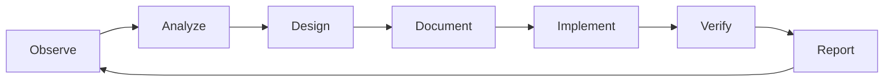

# Reusable Education Game Engineering Playbook

เอกสารนี้สกัดวิธีทำงานที่ใช้ซ้ำได้กับเกมการศึกษาอื่น โดยไม่ผูกกับสูตรคูณหรือธีมเมืองลูมินารา

## 1. เริ่มจากหลักฐานการเรียนรู้ ไม่ใช่เทคโนโลยี

ก่อนเลือก Phaser, AR หรือกราฟิก ต้องตอบให้ได้:

1. เด็กต้องเข้าใจอะไรหลังเล่น ไม่ใช่เพียงตอบอะไรถูก
2. การกระทำใดในเกมเป็นหลักฐานว่าเด็กเข้าใจ
3. ความเข้าใจผิดที่พบบ่อยมีอะไร
4. feedback ใดช่วยแก้ mental model โดยไม่เฉลยทันที
5. จะลด scaffold เมื่อเด็กชำนาญและนำกลับมาเมื่อพลาดอย่างไร

Template:

```text
Learning objective:
Observable action:
Misconceptions:
Representation:
Feedback:
Mastery rule:
Remediation rule:
Transfer challenge:
```

## 2. Story ต้องสร้างเหตุผลให้ “การเรียน” เป็นการกระทำในโลกเกม

Story ที่ดีไม่ใช่ข้อความนำก่อนแบบฝึกหัด แต่ทำให้กลไกการเรียนเป็นกลไกโลก เช่น “รวมพลังเป็นกลุ่มเพื่อซ่อมเมือง” แทน “คำนวณ 7×2”

Checklist:

- เป้าหมายเกมและเป้าหมายการเรียนสอดคล้องกัน
- เด็กรู้ว่าทำไมต้องทำต่อภายใน 5–10 วินาที
- progression เปลี่ยนโลก ตัวละคร หรือความสามารถ ไม่เพิ่มแค่ตัวเลข
- mascot มีบทบาทชี้นำ/ตอบสนอง ไม่ใช่ภาพประดับ
- reward ไม่กลบ learning objective
- failure ใช้ภาษาของโลกเกมและให้โอกาสเรียนใหม่

## 3. Concrete → Representational → Abstract

สำหรับคณิตศาสตร์ ให้ผู้เล่นผ่านลำดับ:

1. Concrete-like interaction: แตะ/ลาก/ชาร์จวัตถุเป็นกลุ่ม
2. Representation: เห็น cluster, array, tens/ones หรือภาพสลับมุมมอง
3. Abstract: เลือกหรือสร้างสัญลักษณ์และผลลัพธ์

อย่ากระโดดไป abstract choice เร็วเกินไป และอย่าบังคับ concrete phase ซ้ำทุกครั้งจนผู้เล่นชำนาญแล้วรู้สึกรำคาญ ใช้ adaptive scaffold

## 4. Progressive disclosure ลด cognitive load

หน้าจอหนึ่งช่วงควรมีคำถามหลักหนึ่งข้อ:

- Phase A: ฉันต้องสร้าง/สังเกตอะไร
- Phase B: สิ่งสองแบบนี้สัมพันธ์กันอย่างไร
- Phase C: ฉันจะเลือกคำตอบใด
- Phase D: เกิดอะไรขึ้นและเรียนรู้อะไร

แสดงสิ่งที่จะเกิดถัดไปได้ แต่ลด emphasis จนถึงเวลาที่ต้องใช้ หลีกเลี่ยงทั้ง “ซ่อนจนงง” และ “แสดงทุกอย่างพร้อมกัน”

## 5. ตัวเลือกและตัวลวงเป็นส่วนของ pedagogy

กติกาแนะนำ:

- คำตอบถูกหนึ่งข้อเสมอ
- ไม่มีตัวเลือกซ้ำ
- ขนาด สี และ animation ไม่ชี้นำคำตอบโดยไม่ตั้งใจ
- ตำแหน่งสลับทุก round แต่ไม่ทับกันและไม่ชิดขอบ
- กระจายเลขหลักสุดท้ายเพื่อป้องกัน elimination shortcut
- ตัวลวงสะท้อน misconception ที่อธิบายได้
- หลังตอบผิด feedback ต้องชี้กลับไปที่ representation

## 6. Unified Input Architecture

Mouse, Touch และ AR ควรแปลงเป็น intent เดียว เช่น:

```text
pointerMove(x, y, source)
pointerEnter(targetId)
pointerProgress(targetId, ratio)
select(targetId, source)
pointerLeave(targetId)
```

Game object ไม่ควรรู้ว่า input มาจาก MediaPipe หรือ mouse

AR rules:

- แสดง pointer เฉพาะเมื่อพบมือและตรวจว่าเป็นนิ้วชี้จริง
- coordinate transform ของ video, mirror, canvas และ CSS ต้องมี owner เดียว
- ใช้ dwell เพื่อป้องกันเลือกโดยบังเอิญ และตั้งค่าได้
- หลังเลือกถูก ย้าย/reset pointer ไป safe zone ก่อนสร้างคำถามใหม่
- มี visual progress ring และ feedback เมื่อ target active
- AR เป็น optional enhancement; core game ต้องเล่นด้วย Mouse/Touch ได้
- ลด inference FPS/ขนาดภาพก่อนลด frame rate ของเกมหลัก

## 7. OOP + Component Boundaries

แยกตามความรับผิดชอบ ไม่ใช่แยกเพราะไฟล์ยาวอย่างเดียว:

- Entity/Actor: identity, transform, animation state
- Field: collection และ spatial layout ของวัตถุชนิดเดียวกัน
- System: กติกาที่ทำงานข้ามหลาย object
- Director: orchestration ของ feedback/milestone
- Store: authoritative domain state
- Service: use case ที่ไม่มี rendering
- Repository: persistence/remote boundary
- Adapter/Bridge: แปลง protocol ระหว่าง Vue, Phaser, MediaPipe

Object ทุกตัวที่สร้าง timer, tween, listener, camera หรือ texture ต้องมี lifecycle `create/update/dispose` ชัดเจน

## 8. SSOT และ Configuration

ค่าที่เปลี่ยนตามเกมต้องอยู่ใน config:

- learning range และ difficulty
- timing, lives, dwell, adaptive thresholds
- asset paths และ frame metadata
- scene/district labels
- progression recipes
- online provider URL และ timeout

ห้าม duplicate magic numbers ใน Vue, Phaser และ CSS หากค่านั้นเป็นกติกาเดียวกัน

Validation ที่ควรมี:

- config schema/version
- asset reference exists
- frame dimensions/grid consistency
- table/multiplier bounds
- timing minimum/maximum
- server/client schema compatibility

## 9. Asset Pipeline

แยกสามชั้น:

```text
source artwork → normalized processed asset → runtime manifest
```

ข้อกำหนด sprite ที่ช่วยลดงานแก้:

- ระบุ output canvas, columns, rows และ frame size
- ระบุ baseline, pivot, padding และ maximum character height
- 0 margin, 0 gutter หาก runtime ใช้ fixed grid
- transparent RGBA จริง
- full body หรือ portrait ต้องไม่ปนกัน
- ทุก pose มี scale/pivot สม่ำเสมอ
- ห้าม shadow/halo/background ที่ฝังมาโดยไม่ตั้งใจ

อย่าแก้ปัญหา sprite crop ด้วยการเดาพิกัดซ้ำในหลายไฟล์ ให้บันทึก metadata ใน manifest และปรับผ่าน pipeline

## 10. Visual Design for Children

- learning object ต้องเด่นกว่าฉากด้วย contrast, depth, glow และ motion ที่มีความหมาย
- ลด saturation/contrast ของฉากหลังบริเวณ gameplay แทนการใส่วงดำทับ
- hit area ใหญ่กว่าภาพ แต่ visual size ต้องไม่หลอกตำแหน่ง
- ใช้ animation แตกต่างกันเล็กน้อยเพื่อให้โลกมีชีวิต ไม่ให้ทุก object ลอยพร้อมจังหวะเดียวกัน
- pulse ใช้กับสถานะ เช่น ready/charging/success ไม่ pulse ทุกอย่างตลอดเวลา
- shiny/gloss/aura ใช้เพื่อสื่อ affordance หรือ rarity ไม่ใช้เป็น noise
- text เด็กต้องอ่านได้บน mobile และฉากรายละเอียดสูง

## 11. Feedback Timing

เมื่อตอบถูก:

1. lock input ทันที
2. confirm target ด้วย flash/scale/sound
3. animate consequence ในโลกเกม
4. update score/reward
5. ให้ mascot ตอบสนอง
6. clear/dispose round เดิม
7. transition แล้วสร้าง round ใหม่เพียงครั้งเดียว

เมื่อตอบผิด:

1. lock target ชั่วคราวเพื่อกัน double submit
2. feedback แบบไม่ทำให้อับอาย
3. ลดหัวใจ/พลังตามโหมด
4. ชี้ misconception ผ่าน representation
5. คืน input เมื่อ state พร้อม

## 12. Score และ Reward Integrity

- คะแนนที่ Hall แสดงควรตรงกับค่าที่ผู้เล่นเห็น
- ห้ามให้ breadth/เวลา/หัวใจสร้างคะแนนลับที่อธิบายไม่ได้
- หากใช้หัวใจเป็นโบนัส ต้องแสดงกติกาก่อนเล่นและในผลลัพธ์
- server ต้องคำนวณคะแนนจาก evidence ใหม่ ไม่เชื่อ `score` จาก client
- signed ticket ต้อง bind session, board และ transcript
- idempotency key ป้องกัน submit ซ้ำ
- leaderboard แยก board ตามกติกาที่มีผลต่อความยุติธรรม

## 13. Agile Kanban Loop ที่ใช้ซ้ำได้

ทุก loop ใช้ลำดับ:



Kanban card ต้องมี:

| Field | ตัวอย่าง |
|---|---|
| Problem | AR pointer ปรากฏแต่เลือกไม่ได้ |
| Evidence | video mirror กับ pointer transform ถูก flip ซ้ำ |
| Learning impact | เด็กไม่เชื่อม action กับ target |
| Acceptance | นิ้วชี้ dwell เลือกได้ 10/10 และ palm ไม่เลือก |
| Scope | AR adapter + selection system + tests |
| Risks | performance, false positive, camera permission |
| Status | Todo / Doing / Verify / Done / Blocked |

Definition of Done:

- acceptance test ผ่าน
- ไม่มี regression ใน input อื่น
- lifecycle/cleanup ผ่าน replay
- docs/config อัปเดต
- browser QA บน viewport เป้าหมาย
- known limitation ถูกบันทึก

## 14. Release Gates

อย่างน้อยต้องมี:

- Learning gate: เด็กทำ action ที่เป็นหลักฐานการเรียนรู้จริง
- Functional gate: full workflow และ replay
- AR device gate: real devices ไม่ใช่ automated logic อย่างเดียว
- Accessibility/input gate: Mouse/Touch fallback
- Performance gate: load, memory, inference budget, backend latency
- Security gate: score proof, rate/abuse controls, no secrets in client
- Child privacy gate: data inventory, notice, consent/legal decision, deletion
- Operations gate: monitoring, rollback, moderation owner

## 15. Starting Template สำหรับเกมถัดไป

1. Project charter
2. Learning design and misconception map
3. Story/world/character bible
4. Core loop and phase wireflow
5. Architecture + ADR
6. SSOT config schema
7. Asset handoff specification
8. Vertical slice หนึ่งโจทย์
9. Automated domain tests
10. Mouse/Touch E2E
11. AR integration หลัง core loop เสถียร
12. Progression/leaderboard หลัง score semantics เสถียร
13. Release gates, privacy และ operations
14. Closeout/lessons learned

