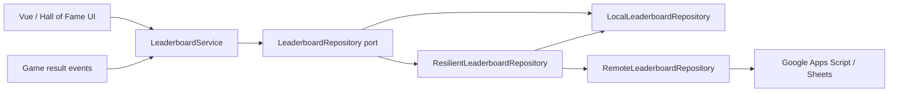

# ADR-005: Progress and Leaderboard Ports

Date: 2026-08-01  
Status: Accepted

## Context

The first release needs a local player profile and local Hall of Fame. A later release may use an online backend. Game rules, Vue UI, and Phaser scenes must not depend directly on `localStorage` or a future HTTP API.

## Decision

Use Ports and Adapters with dependency injection.



JavaScript will express ports as small abstract base classes plus JSDoc contracts. Concrete adapters are selected during bootstrap from configuration.

## Contracts

```js
class LeaderboardRepository {
  async submit(entry) {}
  async getTop(boardKey, limit = 10) {}
  async getPersonalBest(playerId, boardKey) {}
  async removePlayerData(playerId) {}
}

class ProgressRepository {
  async load(playerId) {}
  async save(snapshot) {}
  async reset(playerId) {}
}
```

`LocalLeaderboardRepository` stores versioned data locally. `RemoteLeaderboardRepository` uses the same contract for Google Apps Script. `ResilientLeaderboardRepository` composes both adapters, writes local first, and queues failed remote submissions. Concrete adapters are assembled by the `LeaderboardInfrastructure` namespace factory.

## Player name policy

- The player may type a display name.
- Trim whitespace and limit the name to 12 visible characters.
- Reject control characters, markup, URLs, phone-like strings, and empty names.
- Provide a safe generated fallback name.
- Never use a display name as the persistent player id; generate a local UUID.
- Online mode will require server-side moderation even if local validation already passed.

## Consequences

- Local Hall of Fame can ship without a backend.
- Online support can be added without changing scoring rules or UI components.
- Repository contract tests must run against every adapter.
- Remote submission failures must not destroy local progress.
