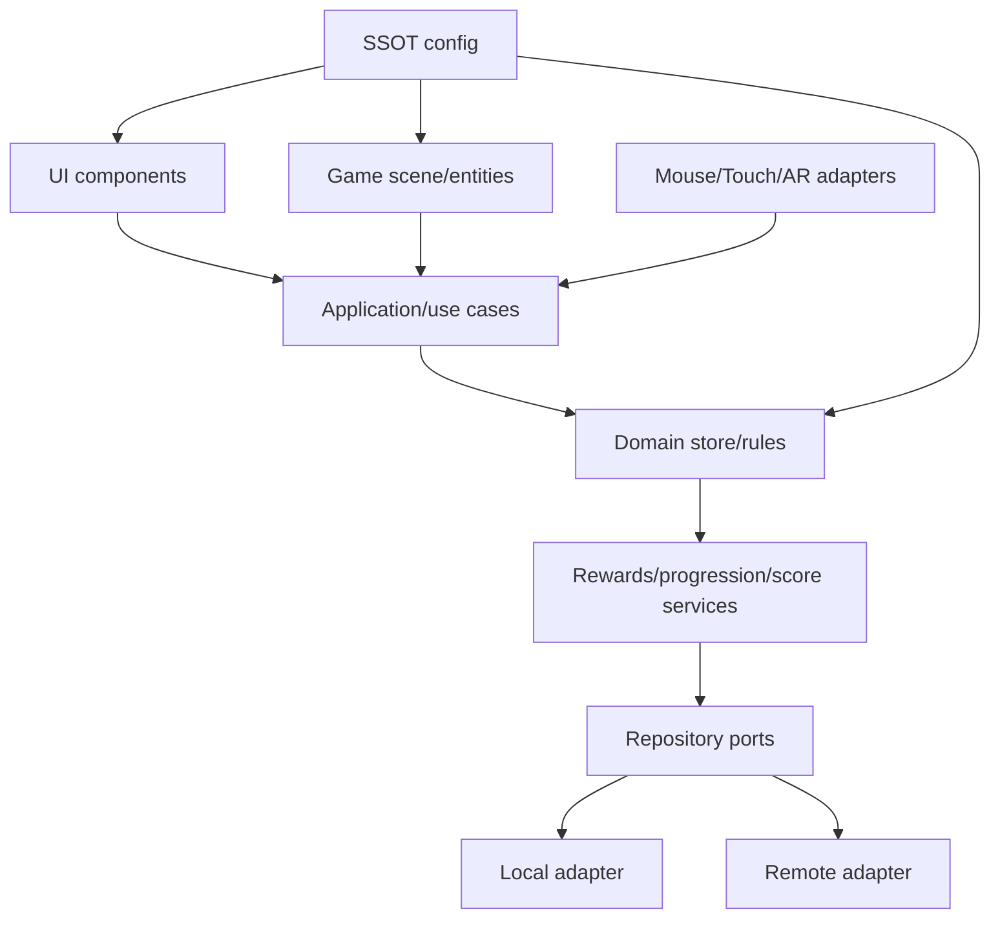

# Production Operating System

## 1. Team Model

| Role | Accountable for |
|---|---|
| Product owner | audience, scope, release decision |
| Learning designer/SME | objective, evidence, misconceptions |
| Game designer | loop, motivation, difficulty, feedback |
| Art director | visual hierarchy, consistency, asset contract |
| Engineer | architecture, lifecycle, performance, security |
| QA | evidence, device matrix, regression, release gates |
| Operations/privacy owner | backend, moderation, incidents, data lifecycle |
| AI | analysis/drafting/implementation/testing under explicit contracts |

AI ไม่แทน accountability ของ SME, privacy/legal หรือ release owner

## 2. Kanban Policy

- WIP limit: หนึ่ง major loop ต่อ owner/AI session
- Card ต้องมี problem evidence และ learning impact
- ห้ามย้าย Done หากไม่มี acceptance evidence
- Blocked ต้องระบุ owner/action ไม่ใช้คำว่า “รอ” อย่างเดียว
- defect แก้ root cause ก่อน visual patch

Board columns:

```text
Backlog → Ready → Analyze → Design/Document → Implement → Verify → Done
                                      ↘ Blocked ↗
```

## 3. Document-Driven Minimum Set

ก่อน code:

- game brief
- learning canvas
- phase wireflow/state diagram
- architecture ownership
- SSOT config draft
- asset contract
- test/acceptance plan

หลัง code:

- implementation report
- defect/root-cause note
- release record
- lessons learned

## 4. Reference Architecture



Dependency rule: outer layer ขึ้นกับ inner contracts; domain ไม่ import Vue, Phaser, MediaPipe หรือ network

## 5. Object Taxonomy

- Actor: ตัวละครและ animation state
- Entity: interactive world object
- Field: layout/collection owner
- System: rule ข้าม entities
- Director: sequencing/feedback/milestone
- Store: authoritative state machine
- Service: application/domain use case
- Repository: persistence contract
- Adapter: external API/input/render integration
- Disposable: owner ของ listeners/timers/tweens/resources

## 6. Lifecycle Contract

ทุก scene/round object ต้องตอบ:

```text
Who creates it?
Who updates it?
Who can call it asynchronously?
Who disposes it?
How is stale work rejected?
Is finish/submit idempotent?
```

ใช้ generation/session token และ disposable collection สำหรับ callback เก่า

## 7. Event Contract

Event name ควรเป็น past-tense fact:

```text
round:created
group:charged
answer:selected
answer:evaluated
reward:granted
session:finished
```

Payload ต้องมี schema และ stable IDs ห้ามส่ง Phaser/Vue object ผ่าน domain event

## 8. Config Contract

Config groups:

- identity/schema
- learning/content bounds
- session/difficulty
- input/AR
- feedback timing
- progression/economy
- asset manifest
- online provider
- accessibility

Config change ที่กระทบ fairness ต้องเปลี่ยน leaderboard board key/schema

## 9. Asset Production Pipeline

```text
Character bible / source art
→ specification validation
→ normalize/crop/alpha check
→ optimize
→ processed path
→ manifest
→ runtime preload/lazy-load
→ visual QA
```

File naming:

- lowercase ASCII สำหรับ runtime path เมื่อทำได้
- stable character/object ID แยกจาก display name
- ห้าม space/case variants ใน production asset
- source และ processed ไม่ overwrite กัน

## 10. Performance Engineering

กำหนด budget ก่อน polish:

| Metric | Starting target |
|---|---:|
| App shell usable | ≤3s on target connection |
| First playable | ≤5s |
| Main game FPS | 50–60 desktop, ≥30 mobile |
| AR inference | 10–20 FPS ตามอุปกรณ์ |
| Input feedback | <100ms Mouse/Touch |
| Round transition | 0.6–1.5s normal |
| Backend warm read | ≤2s target |
| Backend p95 | product-defined hard gate |

ใช้ lazy loading, compressed modern formats และ preload เฉพาะ next-needed asset

## 11. Visual Production Rules

- define focal zone/safe play area ก่อนสร้าง background
- gameplay objects มี silhouette และ contrast แยกจากฉาก
- use one material language per object family
- consistent scale, shadow, outline, glow และ label hierarchy
- motion มี state meaning
- test at smallest target viewport
- ห้ามแก้ overflow ด้วย clip content
- decorations ไม่ทับ hit target/text

## 12. Release Train

```text
Dev → Internal QA → Classroom/Closed Beta → Monitored Public Beta → Production
```

แต่ละขั้นต้องมี rollback target และ owner

