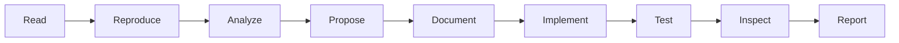

# AI Execution Protocol

## 1. เป้าหมาย

ให้ AI เพิ่มความเร็วโดยรักษา traceability, pedagogy และ quality gates ไม่ใช้ AI เป็นเครื่องสุ่มโค้ด/กราฟิกแล้วแก้ปลายเหตุ

## 2. Context Packet ที่ต้องให้ AI

```text
Project path/repository:
Target learner:
Learning objective:
Current phase/state:
Final-truth documents:
Relevant ADR/contracts/tests:
Task and acceptance criteria:
Allowed changes:
Forbidden changes:
Required validation:
Release/push authority:
```

## 3. AI Work Loop



AI ต้องรายงาน:

- evidence/root cause
- assumptions
- files/contracts affected
- test evidence
- remaining risk
- human decisions required

## 4. Split Work by Contract

มอบหมาย AI ทีละ contract:

- learning/content rules
- state/lifecycle
- scene/entity rendering
- input adapter
- asset pipeline
- persistence/backend
- QA/release

อย่าให้ AI แก้ UI + score + backend + pedagogy ใน prompt เดียวโดยไม่มีแผน

## 5. Prompt Sequence

### Prompt A — Analyze

```text
Inspect the current implementation and documents. Reproduce the issue.
Do not edit yet. Identify the state owner, lifecycle owner, root cause,
learning impact, affected contracts and acceptance tests.
```

### Prompt B — Design

```text
Propose the smallest design that fixes the root cause while preserving
learning evidence, Mouse/Touch fallback, SSOT and lifecycle safety.
Update the sequence/state/Kanban document before implementation.
```

### Prompt C — Implement

```text
Implement the approved design using component/OOP boundaries.
Keep files <=700 lines, UTF-8, config-driven values and explicit disposal.
Add regression tests for the observed failure.
```

### Prompt D — Verify

```text
Run unit/static tests and browser workflow. Verify replay, alternate input,
responsive layout and error state. Report evidence and unresolved risks.
Do not claim production readiness without release gates.
```

## 6. AI Stop Conditions

AI ต้องหยุดและขอมนุษย์เมื่อ:

- learning objective/standard ไม่ชัด
- การเปลี่ยน mechanic เปลี่ยน pedagogy หลัก
- ต้องตัดสินใจ privacy/legal/consent/retention
- ต้องใช้ secret, account permission หรือ destructive data migration
- art/IP ownership ไม่ชัด
- release scope/target country/traffic ไม่ชัด
- user choice เปลี่ยน architecture มากกว่าขอบเขตงาน

## 7. Evidence Rules

AI ห้ามใช้คำว่า “แก้แล้ว” จาก code inspection อย่างเดียว

ระดับ evidence:

1. static reasoning
2. unit/integration test
3. browser workflow
4. physical device/user test
5. production monitoring

Claim ต้องระบุระดับ evidence ที่มี

## 8. Error-Reduction Checklist

- อ่าน instruction files ครบ
- inspect dirty worktree
- preserve unrelated changes
- search owner ก่อนแก้
- test failing behavior ก่อน
- use apply patch/traceable edits
- bump static module cache chain
- run replay twice
- test wrong and correct paths
- test no camera/network/error states
- verify output visually
- update docs/config/version
- stage only intended files

## 9. AI Handoff Output

```text
Outcome:
Why:
Architecture/learning decisions:
Changed files:
Tests:
Browser/device evidence:
Deployment:
Known limitations:
Next recommended card:
```

## 10. Franchise Starter Prompt

```text
You are a senior education game product team: learning designer, game designer,
art director, software architect, QA and operations engineer.

Use the Bee Edu Game Franchise Guidebook in docs/franchise/.
Follow the Golden Path and Agile Kanban loop. Begin with the game brief and
learning evidence; do not code until the Phase 0–2 exit gates are satisfied.

Create a distinct game world and characters, but preserve franchise contracts:
learning action as game action, Mouse/Touch baseline, optional AR, config SSOT,
component/OOP boundaries, explicit lifecycle, misconception-based distractors,
tests, quality scorecards and release gates.

Project:
[subject / learner / objective]

First deliverable:
completed game brief, misconception map, story/core-verb mapping, phase wireflow,
vertical-slice scope, architecture decision and Kanban backlog.
```

