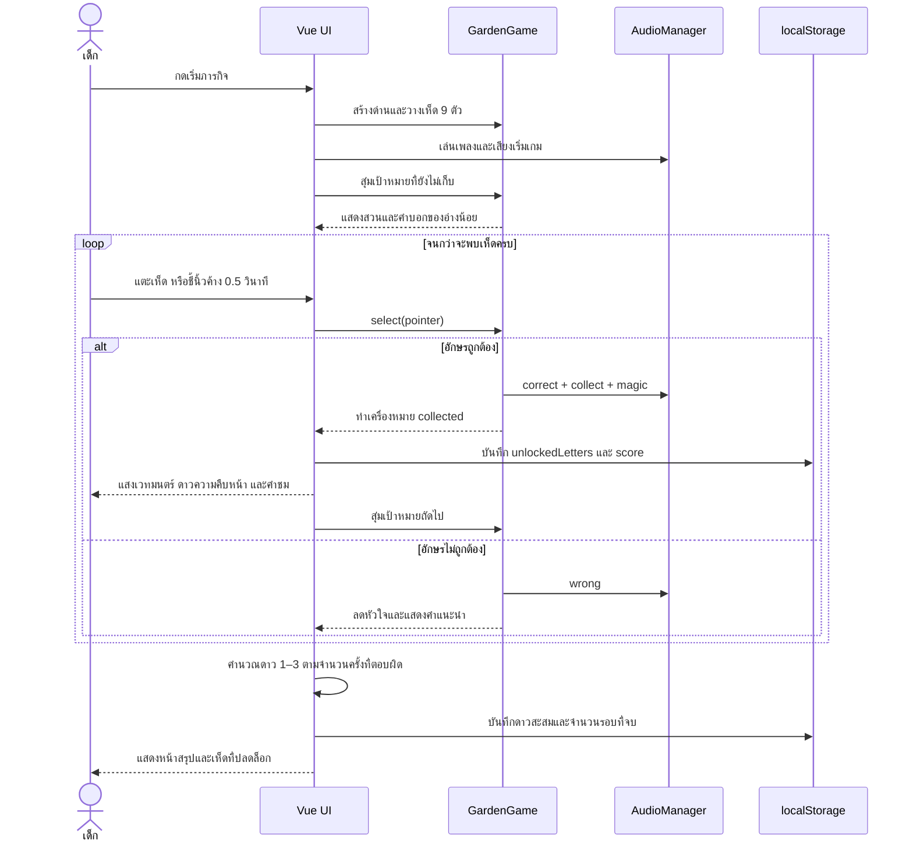

# โครงการเกมการศึกษา: ป่าเห็ดอักษรกลาง

## 1. เป้าหมายการเรียนรู้

เด็กฝึกจำแนกและจดจำพยัญชนะอักษรกลาง 9 ตัว ได้แก่ ก จ ฎ ฏ ด ต บ ป อ ผ่านการฟังคำสั่งจากอ่างน้อย การสังเกตรูปอักษร และการเลือกเห็ดให้ถูกต้อง

## 2. Story และแรงจูงใจ

อ่างน้อยหลงอยู่ในสวนเห็ดมหัศจรรย์ เห็ดอักษรกลางทั้ง 9 ตัวถูกลมพัดกระจายออกจากห้องสะสม เด็กต้องช่วยตามหาเห็ดทีละตัวให้ตรงกับภารกิจของอ่างน้อย เมื่อพบเห็ด เห็ดจะกลับมาอยู่ในห้องสะสมและสวนจะค่อย ๆ ฟื้นฟู

แรงจูงใจหลักมี 3 ชั้น:

1. **ภารกิจทันที:** ตามหาเห็ดให้ตรงกับอักษรที่โจทย์ขอ
2. **ความก้าวหน้าระยะกลาง:** ปลดล็อกเห็ดและเติมห้องสะสมให้ครบ 9 ตัว
3. **รางวัลระยะยาว:** สะสมดาวจากการจบด่าน โดยตอบถูกต่อเนื่องจะได้ดาวมากกว่า

## 3. กติกาดาวและการปลดล็อก

- ตอบถูก: ได้คะแนน 10 คะแนน และปลดล็อกเห็ดอักษรนั้นถ้ายังไม่เคยพบ
- จบภารกิจโดยไม่ตอบผิด: ได้ 3 ดาว
- จบภารกิจโดยตอบผิด 1–2 ครั้ง: ได้ 2 ดาว
- จบภารกิจโดยตอบผิดตั้งแต่ 3 ครั้งขึ้นไป: ได้ 1 ดาว
- ดาว เห็ดที่ปลดล็อก จำนวนรอบที่จบ และคะแนนสูงสุดบันทึกใน `localStorage`
- ห้องสะสมจะแสดง `? / ยังไม่พบ` สำหรับเห็ดที่ยังไม่ปลดล็อก

## 4. Game flow

```text
หน้าแรก
  -> เริ่มภารกิจ
  -> อ่างน้อยสุ่มขออักษรที่ยังไม่ถูกเก็บ
  -> เด็กอ่านและเลือกเห็ด / ชี้นิ้วค้าง 0.5 วินาทีใน AR
  -> ตอบถูก: เอฟเฟกต์ + คะแนน + ปลดล็อกเห็ด
  -> ตอบผิด: เสียหัวใจและลองใหม่
  -> พบครบ 9 ตัว: คำนวณดาวและบันทึกความก้าวหน้า
  -> หน้าสรุป: แสดงดาวรอบนี้ ดาวสะสม และคะแนน
  -> เล่นอีกครั้ง หรือกลับห้องสะสม
```

## 5. Sequence diagram



## 6. โครงสร้างซอฟต์แวร์

- `GardenGame`: วงจรเกม การชน การเลือกเห็ด อนุภาค และสถานะจบด่าน
- `FloatingMushroom`: การลอยตามลม การ pulse และการวาด sprite
- `WindField`: สายลมแปรปรวนแบบสุ่มระยะเวลาและทิศทาง
- `AudioManager`: เพลงพื้นหลังและ SFX ผ่าน Web Audio API
- Vue `setup()`: สถานะหน้าจอ ความก้าวหน้า AR และการเชื่อม UI
- `data/*.json`: ข้อมูลตัวอักษร sprite และด่าน

## 7. เกณฑ์ตรวจรับ

- เด็กเริ่มเล่นและเห็นภารกิจแรกได้
- ตอบถูกแล้วเห็ดหายจากสนามและเพิ่มความคืบหน้า
- ตอบผิดแล้วไม่ถูกนับเป็นการเก็บ
- เมื่อครบ 9 ตัวต้องเปลี่ยนไปหน้าสรุป ไม่ค้าง
- ดาวรอบล่าสุดต้องแสดงถูกต้อง
- ปิด/เปิดหน้าใหม่แล้วดาวและเห็ดที่ปลดล็อกยังคงอยู่
- ห้องสะสมต้องแยกเห็ดที่พบแล้วกับเห็ดที่ยังไม่พบ
- AR ยังคงใช้การชี้นิ้วค้างประมาณ 0.5 วินาที

## 8. Progression หลายด่านที่ implement แล้ว

เกมแบ่งเป็น 3 ด่านใน `data/levels.json`:

| ด่าน | เนื้อหา | จำนวนอักษร |
|---|---|---:|
| 1 | ประตูสวนเห็ด | 3 |
| 2 | สวนคริสตัล | 6 |
| 3 | ห้องโถงอักษรกลาง | 9 |

เด็กเริ่มที่ด่าน 1 เมื่อจบด่าน ระบบจะปลดล็อกด่านถัดไปและแสดงปุ่ม `ไปด่านถัดไป` ในหน้าสรุป ด่านที่ปลดล็อกแล้วและดาวสะสมยังคงอยู่หลังรีเฟรชหรือปิดหน้าเกม
